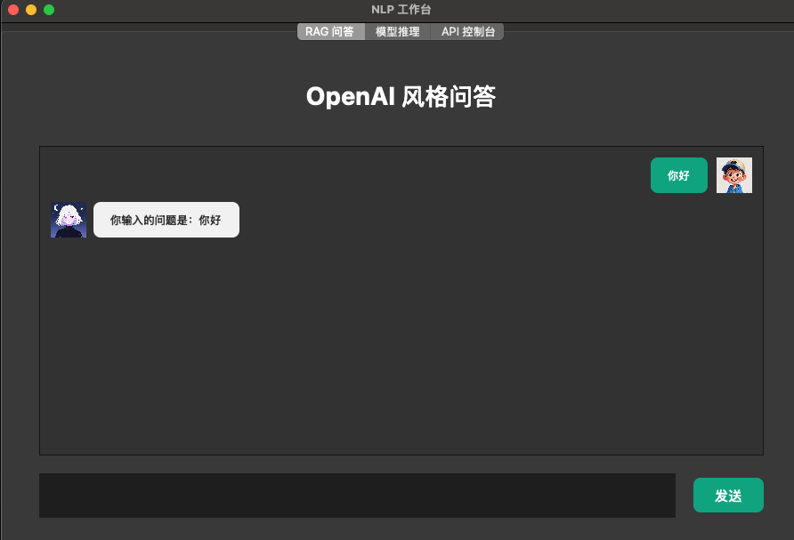
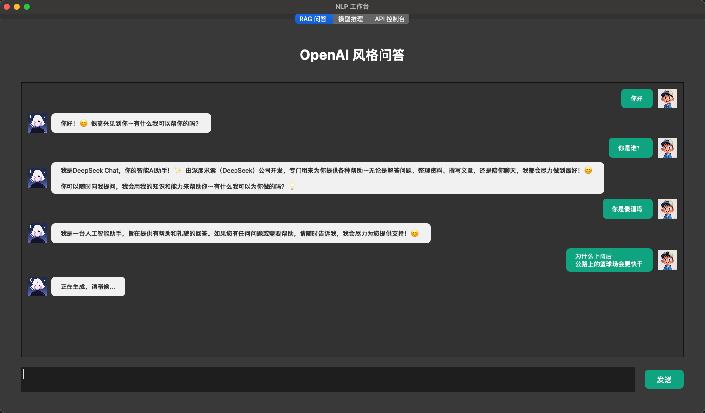
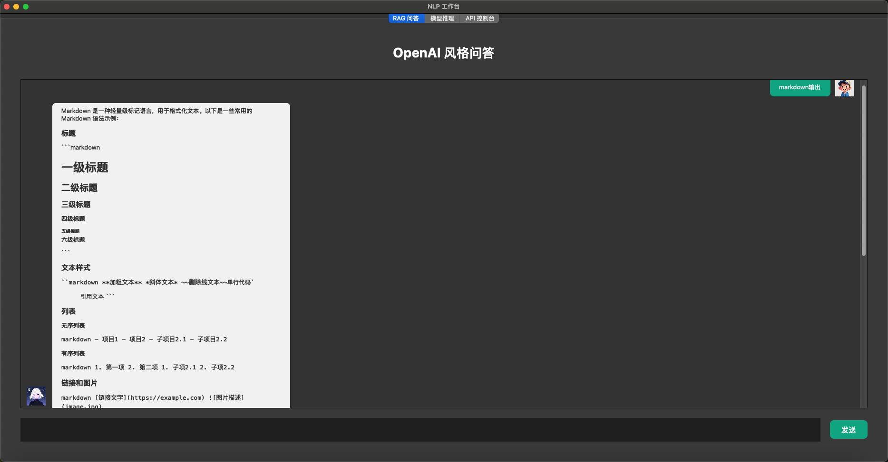
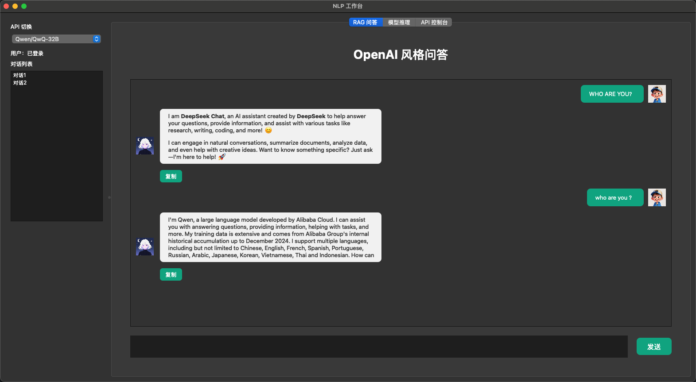

# Kieran NLP

## 项目简介

Kieran NLP 是一个基于 PyQt5 的桌面 GUI 对话系统，支持多标签页、多模型推理、API 控制台等功能。项目已集成硅基流动 API，支持 DeepSeek 大模型对话，支持 Markdown 格式输出，并通过 `.env` 文件私有化管理敏感信息。

## 功能特色

- 多标签页界面（RAG 问答、模型推理、API 控制台）
- 支持硅基流动 DeepSeek 模型流式对话
- 对话界面仿主流 IM，支持头像、气泡、复制、重新生成等功能
- 支持 Markdown 格式输出
- API 密钥等敏感信息通过 `.env` 文件管理
- 友好的加载提示与异步响应

## 安装与运行

1. 安装依赖

   ```
   pip install -r requirements.txt
   ```

2. 配置 `.env` 文件（项目根目录，内容如下）

   ```
   API_KEY=你的apikey
   API_URL=https://api.siliconflow.cn/v1/chat/completions
   ```

3. 运行主程序

   ```
   python main.py
   ```

## 截图

- 项目启动，基本框架  
  
- 接入硅基流动API，实现deepseek对话  
  
- 私有化api等敏感信息到env文件,支持markdown输出  
  
- 增加api切换功能
  


## 更新日志

- 2025-7-24 ：项目启动，基本框架
- 2025-7-25 ：接入硅基流动API，实现deepseek对话
- 2025-7-26 ：私有化api等敏感信息到env文件,支持markdown输出
- 2025-7-27 ：增加api修改功能，你现在可以切换api了

## 目录结构示例

```
kieran-nlp/
├── main.py
├── chat_widget.py
├── chat_interface.py
├── requirements.txt
├── .env
├── README.md
├── asset/
│   ├── user.png
│   └── bot2.png
└── mdfile/
    ├── image.png
    ├── image2.png
    └── image3.png
```

## 免责声明

本项目仅供学习与交流，API 密钥请妥善保管，勿泄露或滥用。
