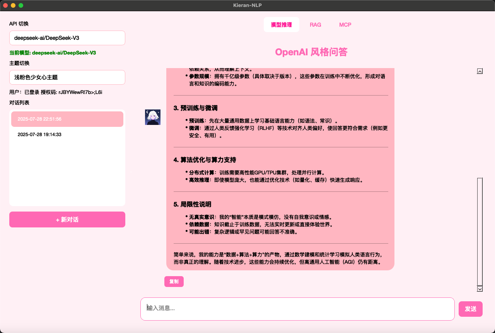

# Kieran NLP

## 项目简介

Kieran NLP 是一个基于 PyQt5 的桌面 GUI 对话系统，专为 AI 大模型对话设计。项目已集成硅基流动 API，支持多种大模型（如 DeepSeek、Qwen 等），支持 Markdown 格式输出，并通过 `.env` 文件私有化管理敏感信息。

## 功能特色

- **多模型支持**：支持多种大语言模型，包括 DeepSeek-V3、Qwen 系列等
- **流式对话**：支持流式输出，实时显示 AI 回复
- **对话管理**：支持创建、重命名、删除多个对话历史
- **IM 风格界面**：对话界面仿主流即时通讯软件，支持头像、气泡显示
- **便捷操作**：支持 Enter 键发送消息、复制回复等功能
- **主题切换**：提供多种界面主题（浅色、深色、粉色、科技风格）
- **Markdown 渲染**：支持 Markdown 格式输出，提升阅读体验
- **安全认证**：通过授权码机制保护应用安全
- **API 管理**：通过 `.env` 文件管理 API 密钥等敏感信息
- **异步响应**：友好的加载提示与异步响应机制

## 安装与运行

1. 安装依赖

   ```bash
   pip install -r requirements.txt
   ```

2. 配置 `.env` 文件（项目根目录，内容如下）

   ```env
   API_KEY=你的apikey
   API_URL=https://api.siliconflow.cn/v1/chat/completions
   ```

3. 配置授权码
   
   在首次运行时，系统会提示输入授权码。预设的授权码保存在 `authorized/auth_code.txt` 文件中。

4. 运行主程序

   ```bash
   python main.py
   ```

## 界面截图

### 项目基本框架


### 模型切换与主题切换


### 对话历史管理



### 用户界面


## 目录结构

```
kieran-nlp/
├── main.py                 # 主程序入口
├── chat_widget.py          # 聊天界面组件
├── chat_interface.py       # 聊天核心逻辑
├── requirements.txt        # 项目依赖
├── .env                    # API 配置文件
├── README.md               # 项目说明文档
├── asset/                  # 资源文件（头像等）
├── authorized/             # 授权码相关文件
├── database/               # 数据库相关文件
├── mdfile/                 # 说明文档图片
├── style/                  # 界面主题样式
└── test/                   # 测试文件
```

## 更新日志

- 2025-7-24 ：项目启动，基本框架
- 2025-7-25 ：接入硅基流动API，实现deepseek对话
- 2025-7-26 ：私有化api等敏感信息到env文件,支持markdown输出
- 2025-7-27 ：增加api修改功能，你现在可以切换api了
- 2025-7-28 ：增加新的大模型api，增加主题功能，增加切换提醒，修复了“复制”多次出现的问题，接入langchain实现对话记忆功能
- 2025-7-28 ：增加使用 Enter 键发送消息功能，发送新消息后自动滚动到对话列表最底部,增加授权码机制，现在你需要输入授权码才能登录
- 2025-7-28 ：增加流式输出，修复若干ui问题，重构渲染逻辑，增加对话列表，你现在可以保存多个对话列表了，增加了对话列表的删除，重命名功能
- 2025-7-29 ：增加了用户界面，轨迹流动余额查询,修复了生成回答时切换对话会闪退，修复了流式输出会导致记忆失效问题

## 免责声明

本项目仅供学习与交流，API 密钥请妥善保管，勿泄露或滥用。

## 待更新

1.

错误处理机制 ：

- 在获取用户信息的方法中，虽然有基本的异常处理，但可以进一步完善错误处理机制，提供更友好的用户提示。
- 在数据库操作中，可以增加更多的异常处理，确保在数据库操作失败时能够优雅地处理错误。

用户体验优化 ：

- 可以增加对话历史的搜索功能，方便用户快速找到之前的对话记录。
- 在用户信息显示部分，可以增加更详细的信息展示，如API使用统计等。

代码结构优化 ：

- 可以考虑将授权验证相关的代码封装成一个独立的模块，提高代码的可维护性。
- 在数据库操作中，可以考虑使用ORM框架来简化数据库操作。

功能扩展 ：

- 可以增加导出对话历史的功能，支持将对话历史导出为文本文件或PDF。
- 可以增加对话标签功能，允许用户为对话添加标签，方便分类和管理。
- 可以增加快捷键支持，提供更多键盘操作的便利性。

性能优化 ：

- 在加载大量对话历史时，可以考虑使用分页加载或懒加载技术，提高界面响应速度。
- 可以优化Markdown渲染性能，特别是在处理包含大量代码块的响应时。

安全性增强 ：

- 可以增加更严格的输入验证，防止潜在的注入攻击。
- 可以考虑对敏感信息（如API密钥）进行加密存储。

1.错误处理机制 ：

- 在获取用户信息的方法中，虽然有基本的异常处理，但可以进一步完善错误处理机制，提供更友好的用户提示。
- 在数据库操作中，可以增加更多的异常处理，确保在数据库操作失败时能够优雅地处理错误。

2.用户体验优化 ：

- 在流式输出过程中，可以增加一个取消按钮，允许用户中断正在进行的对话生成。
- 可以增加对话历史的搜索功能，方便用户快速找到之前的对话记录。
- 在用户信息显示部分，可以增加更详细的信息展示，如API使用统计等。

3.结构优化 ：

- 可以考虑将授权验证相关的代码封装成一个独立的模块，提高代码的可维护性。
- 在数据库操作中，可以考虑使用ORM框架来简化数据库操作。

4.功能扩展 ：

- 可以增加导出对话历史的功能，支持将对话历史导出为文本文件或PDF。
- 可以增加对话标签功能，允许用户为对话添加标签，方便分类和管理。
- 可以增加快捷键支持，提供更多键盘操作的便利性。
5.性能优化 ：

- 在加载大量对话历史时，可以考虑使用分页加载或懒加载技术，提高界面响应速度。
- 可以优化Markdown渲染性能，特别是在处理包含大量代码块的响应时。

6.安全性增强 ：

- 可以增加更严格的输入验证，防止潜在的注入攻击。
- 可以考虑对敏感信息（如API密钥）进行加密存储。
7.测试覆盖 ：

- 可以增加更多的单元测试和集成测试，确保各个功能模块的稳定性和可靠性。
- 可以增加自动化测试脚本，方便进行回归测试。
